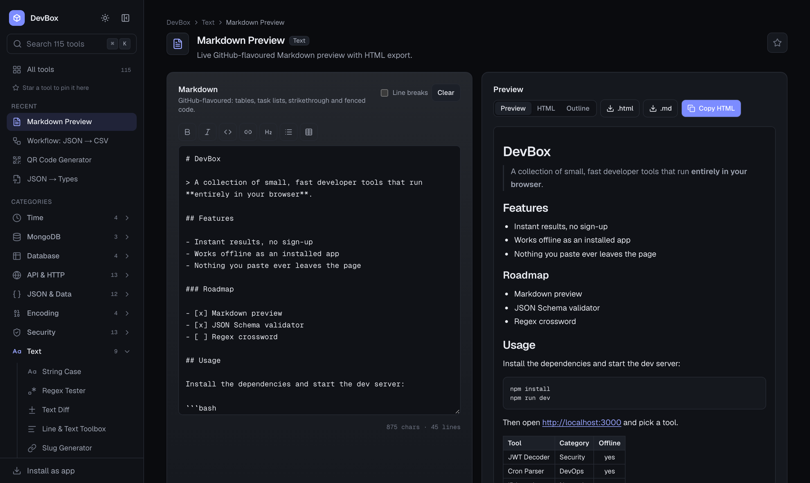
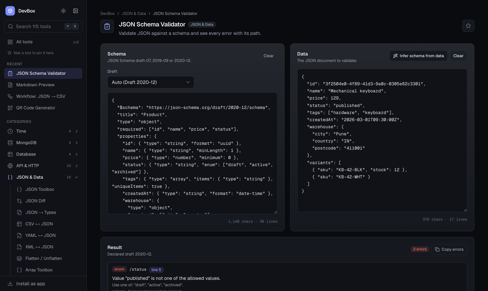
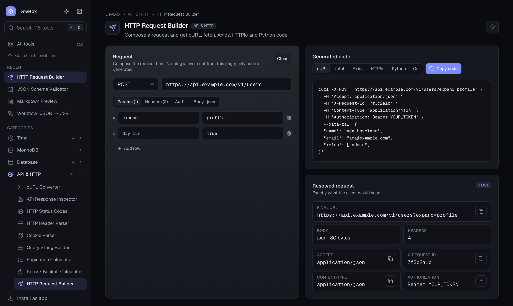
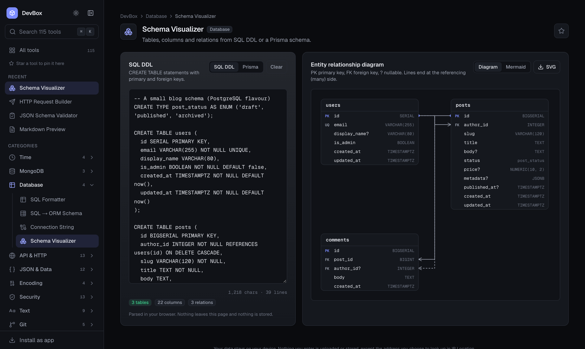
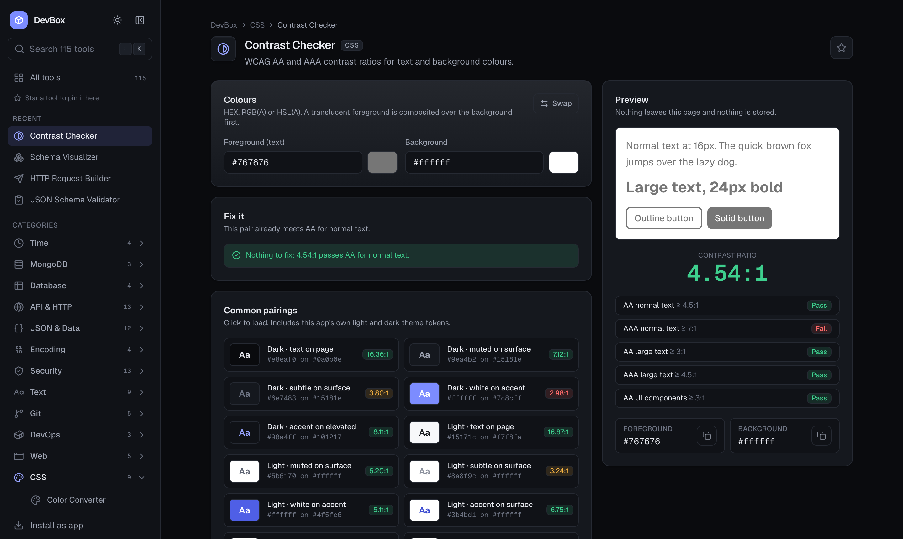
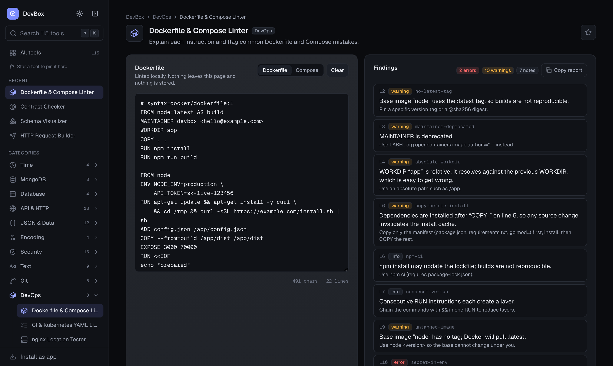
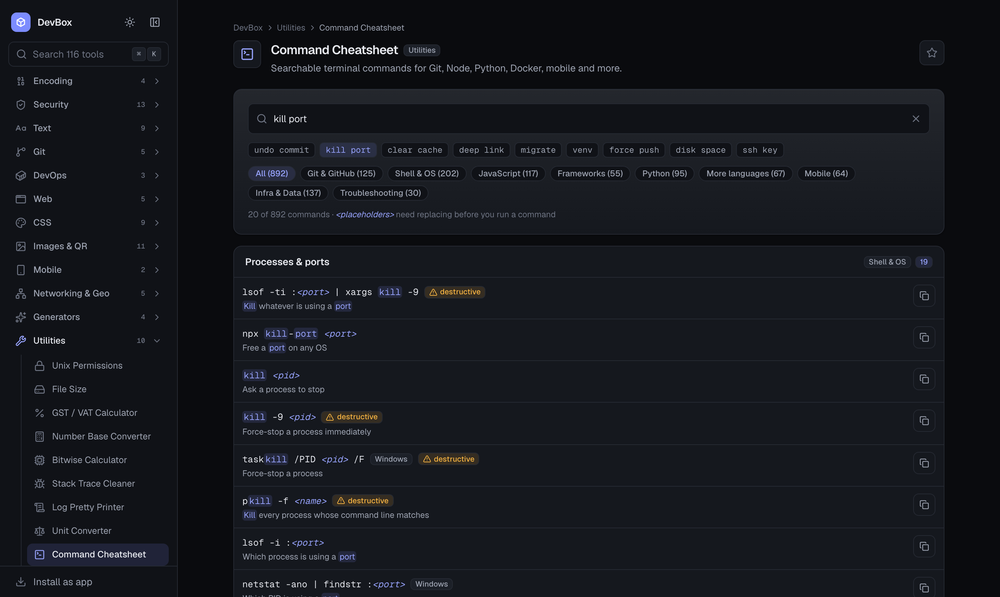
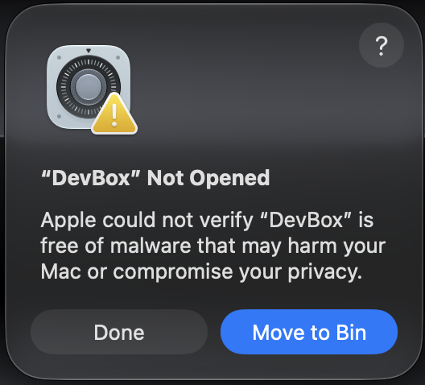

<div align="center">


# DevBox

**116 developer tools. One search. Nothing leaves your browser.**

Format JSON, decode a JWT, test a regex, convert cURL to code, compress an image, generate a QR code, and 110 more everyday tasks, all in one fast, local-only app. Available on the web and as a native desktop app for macOS and Windows.

[**Open the web app**](https://devbox.voyra.co.in) · [**Download for macOS**](https://github.com/shubham8175/devbox/releases/latest/download/DevBox-macOS.dmg) · [**Download for Windows**](https://github.com/shubham8175/devbox/releases/latest/download/DevBox-Windows-Setup.exe) · [Developer docs](DOCS.md)

[](https://github.com/shubham8175/devbox/actions/workflows/desktop-release.yml)
[](https://github.com/shubham8175/devbox/releases/latest)
[](https://github.com/shubham8175/devbox/releases)
[](https://nextjs.org)
[](https://www.typescriptlang.org)
[](https://v2.tauri.app)
[](LICENSE)


</div>

---

## Why DevBox

Most online developer tools send your input to a server, wrap it in ads, and make you hunt through a different site for every task. DevBox is the opposite.

- **Private by design.** Every tool runs in your browser. No accounts, no database, no backend, no analytics. Nothing you paste or upload is stored or sent anywhere. Images and QR codes are processed with the Canvas API on your machine.
- **One place for everything.** 116 tools across 17 categories behind a single search box. Press `⌘K` and type what you want to do, or browse the sidebar, where every category has its own icon and expands in place.
- **Fast.** Every page is statically generated. Heavy libraries such as the SQL formatter load only on the page that needs them.
- **Installs anywhere, works offline.** Add DevBox to your phone's home screen or your desktop's dock straight from the browser. A service worker caches every tool after the first visit, so the whole toolbox works with no connection. The same code also ships as a 10 MB native app for macOS and Windows through Tauri, with no Electron and no bundled browser.
- **Try before you paste.** Tools ship with a **Load sample** button, so you can see real output in one click before bringing your own data.
- **Honest about limits.** Every tool enforces input size limits and reports errors with the exact step that failed, instead of silently truncating or hanging.

## Highlights

### Epoch Converter

Paste a Unix timestamp in seconds or milliseconds, or any ISO 8601 date, and get local time, UTC, ISO 8601, relative time and both Unix forms with one-click copy. The current time ticks live at the top so you always have "now" at hand.

<div align="center">

</div>

### More top tools

<table>
  <tr>
    <td width="50%" valign="top">
      <b>JWT Decoder</b><br/>
      Header, payload and signature split out, every timestamp claim expanded, and a live "expires in" countdown. Decoding only, never verification, and the token never leaves the page.<br/><br/>
      
    </td>
    <td width="50%" valign="top">
      <b>cURL Converter</b><br/>
      Paste a cURL command and get working <code>fetch</code>, Axios or Node code with headers, body and method preserved.<br/><br/>
      
    </td>
  </tr>
  <tr>
    <td width="50%" valign="top">
      <b>JSON Toolbox</b><br/>
      Format, minify, validate and sort JSON with precise error positions for invalid input.<br/><br/>
      
    </td>
    <td width="50%" valign="top">
      <b>Regex Tester</b><br/>
      Live match highlighting, named groups, flags, and a match table you can read at a glance.<br/><br/>
      
    </td>
  </tr>
  <tr>
    <td width="50%" valign="top">
      <b>JSON → Types</b><br/>
      Turn a JSON sample into TypeScript interfaces, type aliases or a Zod schema, nested objects included.<br/><br/>
      
    </td>
    <td width="50%" valign="top">
      <b>QR Code Generator</b><br/>
      Text, URL, Wi-Fi, email, phone and SMS codes with size, margin, colour and error-correction controls. Export PNG or SVG, or copy the image.<br/><br/>
      
    </td>
  </tr>
</table>

### For every stack

Six of the tools added in 0.2, chosen because nearly every developer reaches for them regardless of language or framework.

<table>
  <tr>
    <td width="50%" valign="top">
      <b>Markdown Preview</b><br/>
      GitHub-flavoured rendering with tables, task lists and fenced code, an outline, and one-click export to <code>.html</code> or <code>.md</code>. HTML is sanitised before it is shown.<br/><br/>
      
    </td>
    <td width="50%" valign="top">
      <b>JSON Schema Validator</b><br/>
      Draft-07, 2019-09 and 2020-12. Every error is listed with its JSON path, the failing keyword and the line in your document, and a schema can be inferred from sample data.<br/><br/>
      
    </td>
  </tr>
  <tr>
    <td width="50%" valign="top">
      <b>HTTP Request Builder</b><br/>
      Compose method, URL, params, headers, auth and body, then copy it as cURL, fetch, Axios, HTTPie, Python or Go. Nothing is ever sent.<br/><br/>
      
    </td>
    <td width="50%" valign="top">
      <b>Schema Visualizer</b><br/>
      Paste SQL DDL, a Prisma, Drizzle, TypeORM, Sequelize or Mongoose schema, TypeScript interfaces, or sample MongoDB documents and get an entity relationship diagram with keys and relations, plus a Mermaid export. The source is detected on paste.<br/><br/>
      
    </td>
  </tr>
  <tr>
    <td width="50%" valign="top">
      <b>Contrast Checker</b><br/>
      WCAG AA and AAA results for normal text, large text and UI components, a live preview, and a one-click fix that finds the nearest passing colour.<br/><br/>
      
    </td>
    <td width="50%" valign="top">
      <b>Dockerfile &amp; Compose Linter</b><br/>
      Every instruction explained, and the usual mistakes flagged with a fix: floating tags, secrets in ENV, cache-busting COPY order, missing USER and more.<br/><br/>
      
    </td>
  </tr>
</table>

### Command Cheatsheet

892 terminal commands you actually use, each with a one-line explanation and a copy button. Search by command (`git stash`) or by what you want to do ("undo commit", "kill port", "free disk space"). You can also paste an error message such as `EADDRINUSE`, `ERESOLVE` or "detected dubious ownership" and get the command that fixes it.

<div align="center">

</div>

- **42 sections across 9 stacks:** Git and the GitHub CLI; shell, macOS, Linux server and Windows PowerShell; Node, npm, pnpm, Yarn and Bun; TypeScript, ESLint and testing; Next.js, React, Vite and Svelte; Python, Django, FastAPI and uv; Go, Rust, Java, .NET and PHP; React Native, Android and iOS; Docker, Kubernetes, databases, AWS, Terraform and deploy.
- **Common fixes:** 30 commands matched to the error they fix, from npm permission errors and heap out of memory to CocoaPods, Xcode licence and Gradle JDK problems.
- **Safe to skim:** commands that delete data, discard work or kill processes carry a **destructive** badge. OS-specific commands are labelled macOS, Linux or Windows, and `<placeholders>` are highlighted so you know what to replace.
- **Filter and share:** narrow by stack or section, expand collapsed sections, press `Esc` to clear the search, and share a search as a link (`/tools/commands?q=kill+port`).

## Download

| Platform | Download | Notes |
| --- | --- | --- |
| **Web** | [devbox.voyra.co.in](https://devbox.voyra.co.in) | Nothing to install. Works in every modern browser. |
| **iPhone / iPad** | Open the site in Safari, tap **Share**, then **Add to Home Screen** | Installs as a standalone app with its own icon. Works offline once opened. |
| **Android** | Open the site in Chrome, tap **Install as app** in the sidebar (or the browser menu) | Same as above. Shared text and links can be sent straight to the QR tool. |
| **macOS** | [DevBox-macOS.dmg](https://github.com/shubham8175/devbox/releases/latest/download/DevBox-macOS.dmg) | Universal build for Apple Silicon and Intel. macOS 11.3 or later. |
| **Windows** | [DevBox-Windows-Setup.exe](https://github.com/shubham8175/devbox/releases/latest/download/DevBox-Windows-Setup.exe) | Windows 10 and 11. Installs for the current user, no admin needed. |

The desktop builds are not yet notarized by Apple, so both operating systems warn on first launch.

- **macOS** shows the dialog below on first launch. It is expected, not a sign that the download is broken.

  

  **Why it happens.** Every app downloaded from the internet is tagged by macOS as "quarantined". When you open a quarantined app, Gatekeeper checks whether Apple has notarized it, which means the developer uploaded it to Apple for an automated malware scan using a paid Apple Developer account. DevBox is a free open source project and is not enrolled in that program, so the check has no record of the app and macOS refuses to open it. The wording is generic Apple text shown for any un-notarized app, and it says nothing about what the app actually does. DevBox runs entirely on your machine, never uploads your data, and the [source](https://github.com/shubham8175/devbox) is public.

  **How to open it.** Newer macOS no longer offers "Open" from the right-click menu, and the app cannot be approved while it is still inside the disk image, so the order matters:

  1. Drag DevBox into the Applications folder and eject the disk image.
  2. Open DevBox from Applications. When the warning appears, click **Done** (not **Move to Bin**).
  3. Open System Settings → Privacy & Security, scroll down, and click **Open Anyway** next to DevBox. Confirm with your password. The button only appears within about an hour of step 2.

  Or skip the dialogs entirely by running this in Terminal after step 1:

  ```sh
  xattr -cr /Applications/DevBox.app
  ```

- **Windows** shows a SmartScreen dialog. Choose **More info** and then **Run anyway**.

## Tools

Every tool lives at `/tools/<id>`. The full registry is in `src/data/tools.ts`.

| Category | Tools |
| --- | --- |
| **JSON & Data** | JSON Toolbox, JSON Diff, JSON → Types (TypeScript and Zod), CSV ↔ JSON, YAML ↔ JSON, XML ↔ JSON, Flatten / Unflatten, Array Toolbox, JSONPath, Workflow: JSON → CSV, JSON Schema Validator, JSON Patch |
| **API & HTTP** | cURL Converter (fetch, Axios, Node), API Response Inspector, HTTP Status Codes, HTTP Header Parser, Cookie Parser, Query String Builder, Pagination, Retry / Backoff, HTTP Request Builder, OpenAPI Viewer, MIME Type Lookup, User-Agent Parser, GraphQL Formatter |
| **Security** | JWT Decoder, JWT Builder, Hash, HMAC, Password Generator, Password Strength, Password Hasher (bcrypt, PBKDF2), File Checksum, .env Comparator, .env Validator, Key Pair Generator, TOTP Generator, Certificate Decoder |
| **Text** | String Case, Regex Tester (with cheat sheet), Text Diff, Line & Text Toolbox, Slug, Invisible Characters, Unicode Inspector, Markdown Preview, Text Statistics |
| **Images & QR** | Color Picker, Metadata (EXIF), Compressor, Resizer, Format Converter, Image → Base64, App Icon Generator, Aspect Ratio, QR Generator, QR Reader, SVG Optimizer & JSX |
| **Time** | Epoch Converter, Date Difference, Timezone Converter, Cron Helper |
| **Git** | Commit Builder, .gitignore Generator, Diff Viewer, Semver, npm Range Explainer |
| **DevOps** | Dockerfile & Compose Linter, CI & Kubernetes YAML Linter, nginx Location Tester |
| **Web** | URL Toolbox, Meta Tags, Open Graph Preview, Device & Browser Info, HTML / CSS / JS Formatter (Prettier) |
| **CSS** | Color Converter, Unit Converter, Gradient, Box Shadow, Contrast Checker, Tailwind ↔ CSS, Flexbox & Grid Playground, Cubic Bezier, clamp() Calculator |
| **Networking & Geo** | IP / CIDR, IP ↔ Integer, IP Location, Coordinate Distance, Lat / Lng Formatter |
| **Generators** | UUID, Random ID, Mock Data, Lorem Ipsum |
| **Utilities** | Unix Permissions, File Size, GST / VAT, Number Base, Bitwise, Stack Trace Cleaner, Log Pretty Printer, Unit Converter, Command Cheatsheet, Scratchpad |
| **MongoDB** | ObjectId, Query Formatter, Aggregation Explainer |
| **Mobile** | Deep Link Builder, Android Intent URI |
| **Encoding** | Base64, Escape / Unescape, Hex Viewer, HTML Entities |
| **Database** | SQL Formatter, SQL → ORM Schema, Connection String, Schema Visualizer |

### Workflows

**JSON → CSV** (`/tools/workflow-json-csv`) chains three tools into one page: parse JSON, select rows with a JSONPath expression, export CSV. Each step reports its own outcome, so an empty result tells you whether parsing, selection or conversion failed. [CASE_STUDY.md](CASE_STUDY.md) covers the design, privacy decisions, edge cases and measured results.

<div align="center">

</div>

## Keyboard shortcuts

| Keys | Action |
| --- | --- |
| `⌘K` / `Ctrl+K` or `/` | Open the command palette |
| `⌘B` / `Ctrl+B` | Collapse or expand the sidebar |
| `⌘[` / `⌘]` or `Alt+←` / `Alt+→` | Go back or forward (the desktop app also supports two-finger swipe on macOS) |
| `Esc` | Close any overlay |
| `g h` | Go home |
| `g j` | JSON Toolbox |
| `g e` | Epoch Converter |
| `g t` | JWT Decoder |
| `g o` | MongoDB ObjectId |
| `g u` | UUID Generator |
| `g r` | Regex Tester |

### Navigation

- **Sidebar.** Every category has an icon and a tool count. Click a category to expand its tools in place; the category of the tool you are on opens automatically and the current tool is scrolled into view.
- **Collapsed rail.** Press `⌘B` to shrink the sidebar to a column of icons. Hover or focus a category icon to get a flyout listing its tools, so you can jump anywhere without expanding it again.
- **Favorites and Recent.** Star any tool to pin it to the top of the sidebar and the home page. The last few tools you opened appear under **Recent** in both places.
- **Command palette.** `⌘K` searches all 116 tools by name, description, keyword or category, with typo tolerance.

Only tool ids and UI preferences (favorites, recents, theme, sidebar state) are stored in `localStorage`, never your input. The one exception is the Scratchpad, which keeps notes in this browser only after you switch that on.

## Privacy and security

- **No network calls with your data, with one labelled exception.** The Content Security Policy restricts `connect-src` to the site itself plus the geolocation services used by the IP Location tool. That tool sends the address you typed to [ipwho.is](https://ipwho.is) (or [ipinfo.io](https://ipinfo.io) when that fails) when you press **Look up**, and asks [ipify](https://www.ipify.org) for your own public address when you press **Detect my IP**. Nothing is sent while typing or on page load, and reserved addresses such as 192.168.x.x are answered locally. The only other outbound request is the Open Graph preview's optional "Load remote image" button, which asks your browser to fetch a URL you typed.
- **No storage of input, unless you opt in.** Tool input lives in React state and is gone when you close the tab. The only exception is the Scratchpad tool: notes stay in the tab until you tick **Keep notes in this browser**, which stores them unencrypted in `localStorage` on that device; turning it off deletes them. A Playwright test types a sentinel string into a tool, triggers a download, and asserts it never appears in any request, URL, cookie, `localStorage`, `sessionStorage` or IndexedDB.
- **The offline cache holds only the app.** The service worker caches same-origin pages and build assets so tools work offline. It never sees a request carrying your input: it ignores cross-origin requests, so the IP Location lookups pass straight through it. That tool needs a connection for public addresses; everything else works offline.
- **Strict headers on the web build.** CSP, `X-Frame-Options`, `Referrer-Policy` and `Permissions-Policy` are set in `next.config.ts`. The desktop build applies an equivalent CSP from `src-tauri/tauri.conf.json`.
- **Minimal desktop surface.** The Tauri shell exposes only `core:default`. No filesystem, shell, HTTP or dialog plugins reach the webview. Downloads are written to your Downloads folder by the Rust side and nothing else.
- **Few dependencies.** Beyond React and Next: `lucide-react`, `qrcode`, `jsqr`, `yaml`, `sql-formatter`, `semver`, `prettier` (code, GraphQL formatting), `marked` and `dompurify` (Markdown preview, sanitised before render), and `bcryptjs`. Each heavy library loads only on the tool that needs it. CSV, XML, JSONPath, EXIF, ZIP, diff, ASN.1/X.509, TOTP, JSON Schema, JSON Patch, DDL parsing and the Tailwind translator are implemented in `src/lib/tools` and have no third-party code.

## Development

Requires Node.js 20 or later. Use npm; `package-lock.json` is the lockfile.

```bash
git clone https://github.com/shubham8175/devbox.git
cd devbox
npm install
npm run dev          # http://localhost:3000
```

| Command | What it does |
| --- | --- |
| `npm run dev` | Start the dev server |
| `npm run build` | Production build, every route statically generated |
| `npm start` | Serve the production build |
| `npm run lint` | ESLint |
| `npx tsc --noEmit` | Type-check |
| `npm test` | Unit tests (Vitest) |
| `npm run test:e2e` | Browser tests (Playwright), builds and serves production first |
| `npm run desktop:dev` | Open the app in a native Tauri window (needs Rust) |
| `npm run desktop:build` | Build the desktop installer for your OS |

### Project layout

```
src/
  app/            routes, one folder per tool under app/tools
  components/     UI primitives, layout, command palette, per-tool UIs
  data/tools.ts   the tool registry: navigation, search, routes and metadata derive from it
  hooks/          useCopy, useNow, useHydrated
  lib/tools/      pure TypeScript logic, no React, unit-tested
  lib/store.ts    favorites, recents and sidebar preferences
src-tauri/        Tauri desktop shell (Rust) and config
e2e/              Playwright browser tests
.github/          release workflow and README assets
```

### Adding a tool

1. Add the pure logic to `src/lib/tools/` with unit tests.
2. Build the UI in `src/components/tools/` and a page in `src/app/tools/<id>/`.
3. Register it in `src/data/tools.ts`. Navigation, search, sitemap and metadata update automatically.

The full guide, including shared building blocks, input limits, error handling and the review checklist, is in [DOCS.md](DOCS.md).

### Releasing the desktop app

Bump `version` in `package.json`, commit, then push a tag:

```bash
git tag v0.2.0
git push origin main v0.2.0
```

The [Desktop release](.github/workflows/desktop-release.yml) workflow builds a universal macOS `.dmg` and a Windows setup `.exe`, and publishes both to a GitHub Release under fixed file names. The download links above always point at the newest release.

## Stack

[Next.js](https://nextjs.org) App Router · [TypeScript](https://www.typescriptlang.org) · [Tailwind CSS v4](https://tailwindcss.com) · [Tauri v2](https://v2.tauri.app) · [Vitest](https://vitest.dev) · [Playwright](https://playwright.dev) · [Lucide](https://lucide.dev) icons

## License

[MIT](LICENSE). Use it, fork it, ship it, just keep the copyright notice.

## Contributing

Issues and pull requests are welcome. Please open an issue first for new tools so we can agree on scope, then follow the checklist in [DOCS.md](DOCS.md#16-conventions-and-checklist). Run `npm run lint`, `npx tsc --noEmit` and `npm test` before opening a PR.

---

<div align="center">
Built by <a href="https://github.com/shubham8175">Shubham</a>. If DevBox saves you time, a ⭐ helps others find it.
</div>
