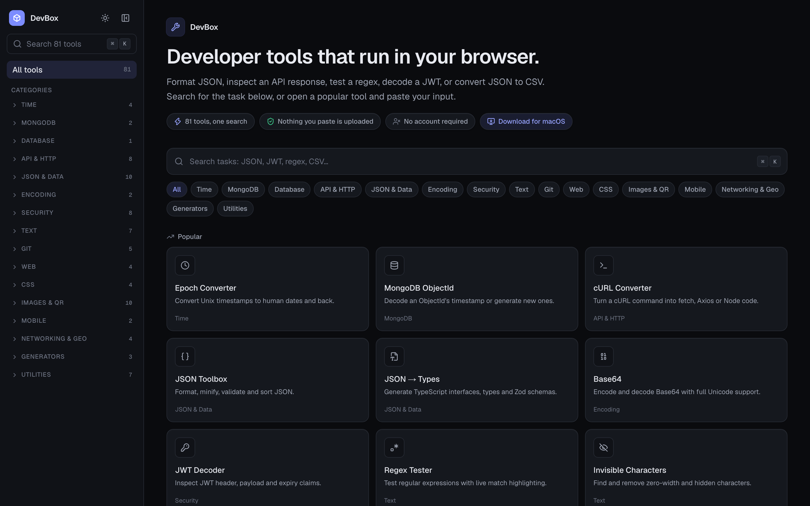
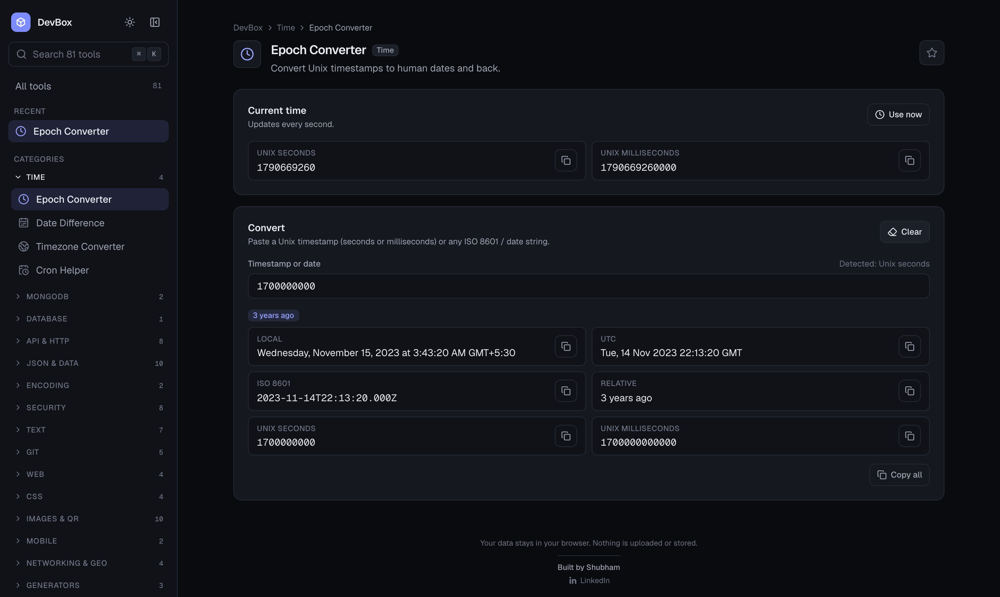
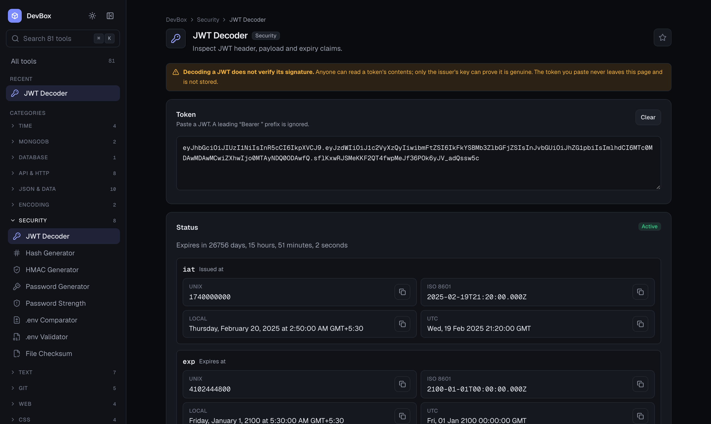
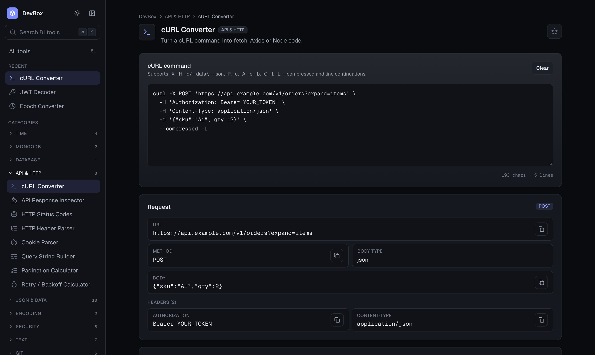
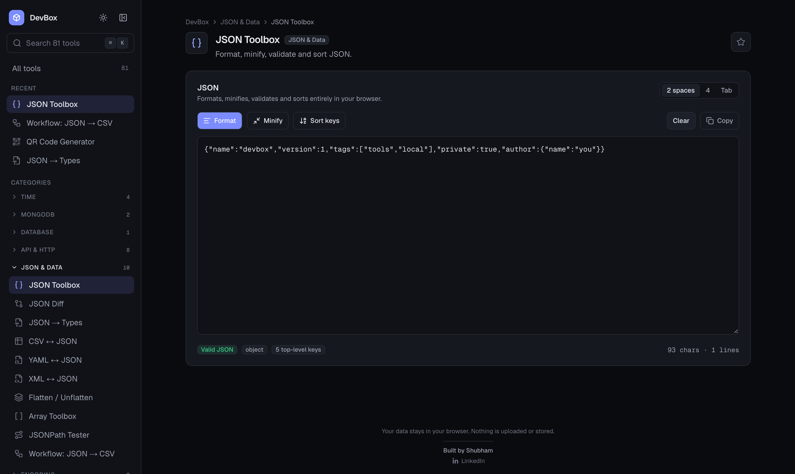
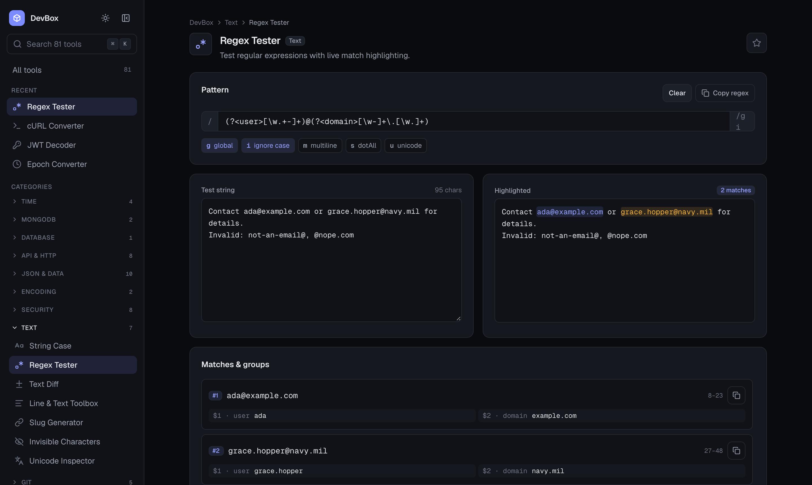
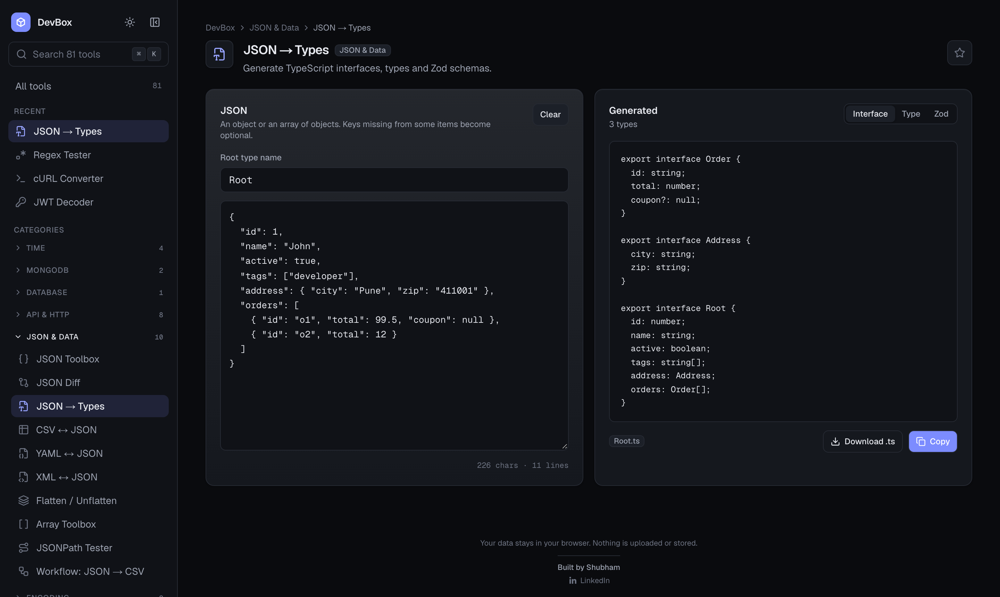
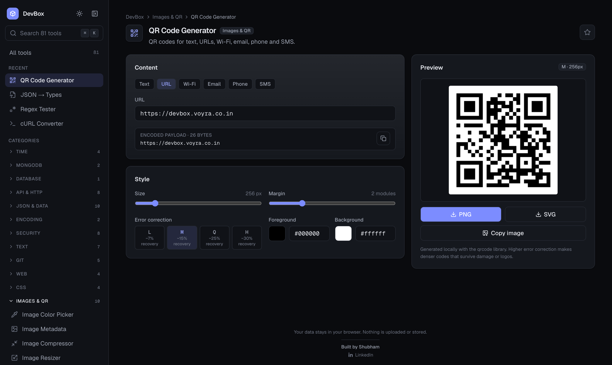
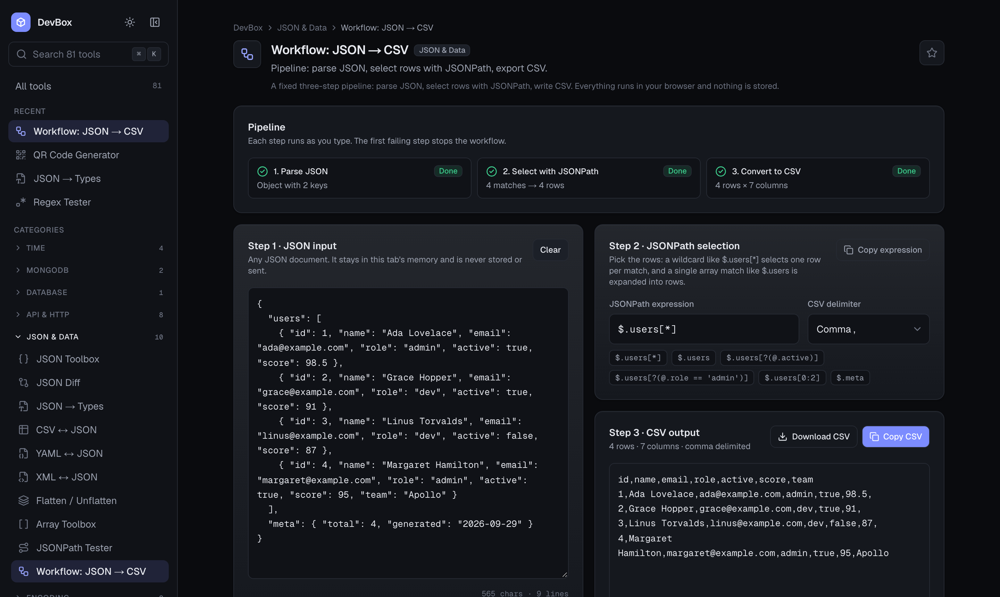

<div align="center">


# DevBox

**81 developer tools. One search. Nothing leaves your browser.**

Format JSON, decode a JWT, test a regex, convert cURL to code, compress an image, generate a QR code, and 75 more everyday tasks, all in one fast, local-only app. Available on the web and as a native desktop app for macOS and Windows.

[**Open the web app**](https://devbox.voyra.co.in) · [**Download for macOS**](https://github.com/shubham8175/devbox/releases/latest/download/DevBox-macOS.dmg) · [**Download for Windows**](https://github.com/shubham8175/devbox/releases/latest/download/DevBox-Windows-Setup.exe) · [Developer docs](DOCS.md)

[](https://github.com/shubham8175/devbox/actions/workflows/desktop-release.yml)
[](https://github.com/shubham8175/devbox/releases/latest)
[](https://github.com/shubham8175/devbox/releases)
[](https://nextjs.org)
[](https://www.typescriptlang.org)
[](https://v2.tauri.app)
[](LICENSE)



</div>

---

## Why DevBox

Most online developer tools send your input to a server, wrap it in ads, and make you hunt through a different site for every task. DevBox is the opposite.

- **Private by design.** Every tool runs in your browser. No accounts, no database, no backend, no analytics. Nothing you paste or upload is stored or sent anywhere. Images and QR codes are processed with the Canvas API on your machine.
- **One place for everything.** 81 tools across 16 categories behind a single search box. Press `⌘K` and type what you want to do.
- **Fast.** Every page is statically generated. Heavy libraries such as the SQL formatter load only on the page that needs them.
- **Works offline as a desktop app.** The same code ships as a 10 MB native app for macOS and Windows through Tauri, with no Electron and no bundled browser.
- **Try before you paste.** Tools ship with a **Load sample** button, so you can see real output in one click before bringing your own data.
- **Honest about limits.** Every tool enforces input size limits and reports errors with the exact step that failed, instead of silently truncating or hanging.

## Highlights

### Epoch Converter

Paste a Unix timestamp in seconds or milliseconds, or any ISO 8601 date, and get local time, UTC, ISO 8601, relative time and both Unix forms with one-click copy. The current time ticks live at the top so you always have "now" at hand.

<div align="center">

</div>

### More top tools

<table>
  <tr>
    <td width="50%" valign="top">
      <b>JWT Decoder</b><br/>
      Header, payload and signature split out, every timestamp claim expanded, and a live "expires in" countdown. Decoding only, never verification, and the token never leaves the page.<br/><br/>
      
    </td>
    <td width="50%" valign="top">
      <b>cURL Converter</b><br/>
      Paste a cURL command and get working <code>fetch</code>, Axios or Node code with headers, body and method preserved.<br/><br/>
      
    </td>
  </tr>
  <tr>
    <td width="50%" valign="top">
      <b>JSON Toolbox</b><br/>
      Format, minify, validate and sort JSON with precise error positions for invalid input.<br/><br/>
      
    </td>
    <td width="50%" valign="top">
      <b>Regex Tester</b><br/>
      Live match highlighting, named groups, flags, and a match table you can read at a glance.<br/><br/>
      
    </td>
  </tr>
  <tr>
    <td width="50%" valign="top">
      <b>JSON → Types</b><br/>
      Turn a JSON sample into TypeScript interfaces, type aliases or a Zod schema, nested objects included.<br/><br/>
      
    </td>
    <td width="50%" valign="top">
      <b>QR Code Generator</b><br/>
      Text, URL, Wi-Fi, email, phone and SMS codes with size, margin, colour and error-correction controls. Export PNG or SVG, or copy the image.<br/><br/>
      
    </td>
  </tr>
</table>

## Download

| Platform | Download | Notes |
| --- | --- | --- |
| **Web** | [devbox.voyra.co.in](https://devbox.voyra.co.in) | Nothing to install. Works in every modern browser. |
| **macOS** | [DevBox-macOS.dmg](https://github.com/shubham8175/devbox/releases/latest/download/DevBox-macOS.dmg) | Universal build for Apple Silicon and Intel. macOS 11.3 or later. |
| **Windows** | [DevBox-Windows-Setup.exe](https://github.com/shubham8175/devbox/releases/latest/download/DevBox-Windows-Setup.exe) | Windows 10 and 11. Installs for the current user, no admin needed. |

The desktop builds are not yet code-signed. On macOS, right-click the app and choose **Open** the first time. On Windows, choose **More info** and then **Run anyway** in the SmartScreen dialog.

## Tools

Every tool lives at `/tools/<id>`. The full registry is in `src/data/tools.ts`.

| Category | Tools |
| --- | --- |
| **JSON & Data** | JSON Toolbox, JSON Diff, JSON → Types (TypeScript and Zod), CSV ↔ JSON, YAML ↔ JSON, XML ↔ JSON, Flatten / Unflatten, Array Toolbox, JSONPath, Workflow: JSON → CSV |
| **API & HTTP** | cURL Converter (fetch, Axios, Node), API Response Inspector, HTTP Status Codes, HTTP Header Parser, Cookie Parser, Query String Builder, Pagination, Retry / Backoff |
| **Security** | JWT Decoder, Hash, HMAC, Password Generator, Password Strength, File Checksum, .env Comparator, .env Validator |
| **Text** | String Case, Regex Tester, Text Diff, Line & Text Toolbox, Slug, Invisible Characters, Unicode Inspector |
| **Images & QR** | Color Picker, Metadata (EXIF), Compressor, Resizer, Format Converter, Image → Base64, App Icon Generator, Aspect Ratio, QR Generator, QR Reader |
| **Time** | Epoch Converter, Date Difference, Timezone Converter, Cron Helper |
| **Git** | Commit Builder, .gitignore Generator, Diff Viewer, Semver, npm Range Explainer |
| **Web** | URL Toolbox, Meta Tags, Open Graph Preview, Device & Browser Info |
| **CSS** | Color Converter, Unit Converter, Gradient, Box Shadow |
| **Networking & Geo** | IP / CIDR, IP ↔ Integer, Coordinate Distance, Lat / Lng Formatter |
| **Generators** | UUID, Random ID, Mock Data |
| **Utilities** | Unix Permissions, File Size, GST / VAT, Number Base, Bitwise, Stack Trace Cleaner, Log Pretty Printer |
| **MongoDB** | ObjectId, Query Formatter |
| **Mobile** | Deep Link Builder, Android Intent URI |
| **Encoding** | Base64, Escape / Unescape |
| **Database** | SQL Formatter |

### Workflows

**JSON → CSV** (`/tools/workflow-json-csv`) chains three tools into one page: parse JSON, select rows with a JSONPath expression, export CSV. Each step reports its own outcome, so an empty result tells you whether parsing, selection or conversion failed. [CASE_STUDY.md](CASE_STUDY.md) covers the design, privacy decisions, edge cases and measured results.

<div align="center">

</div>

## Keyboard shortcuts

| Keys | Action |
| --- | --- |
| `⌘K` / `Ctrl+K` or `/` | Open the command palette |
| `⌘B` / `Ctrl+B` | Collapse or expand the sidebar |
| `Esc` | Close any overlay |
| `g h` | Go home |
| `g j` | JSON Toolbox |
| `g e` | Epoch Converter |
| `g t` | JWT Decoder |
| `g o` | MongoDB ObjectId |
| `g u` | UUID Generator |
| `g r` | Regex Tester |

Star any tool to pin it to **Favorites**. Recently used tools appear on the home page. Only tool ids and UI preferences are stored in `localStorage`, never your input.

## Privacy and security

- **No network calls with your data.** The Content Security Policy is `connect-src 'self'`. The only outbound request any tool can make is the Open Graph preview's optional "Load remote image" button, which asks your browser to fetch a URL you typed.
- **No storage of input.** Tool input lives in React state and is gone when you close the tab. A Playwright test types a sentinel string into a tool, triggers a download, and asserts it never appears in any request, URL, cookie, `localStorage`, `sessionStorage` or IndexedDB.
- **Strict headers on the web build.** CSP, `X-Frame-Options`, `Referrer-Policy` and `Permissions-Policy` are set in `next.config.ts`. The desktop build applies an equivalent CSP from `src-tauri/tauri.conf.json`.
- **Minimal desktop surface.** The Tauri shell exposes only `core:default`. No filesystem, shell, HTTP or dialog plugins reach the webview. Downloads are written to your Downloads folder by the Rust side and nothing else.
- **Few dependencies.** Beyond React and Next: `lucide-react`, `qrcode`, `jsqr`, `yaml`, `sql-formatter` and `semver`. CSV, XML, JSONPath, EXIF, ZIP and diff logic are implemented in `src/lib/tools` and have no third-party code.

## Development

Requires Node.js 20 or later. Use npm; `package-lock.json` is the lockfile.

```bash
git clone https://github.com/shubham8175/devbox.git
cd devbox
npm install
npm run dev          # http://localhost:3000
```

| Command | What it does |
| --- | --- |
| `npm run dev` | Start the dev server |
| `npm run build` | Production build, every route statically generated |
| `npm start` | Serve the production build |
| `npm run lint` | ESLint |
| `npx tsc --noEmit` | Type-check |
| `npm test` | Unit tests (Vitest) |
| `npm run test:e2e` | Browser tests (Playwright), builds and serves production first |
| `npm run desktop:dev` | Open the app in a native Tauri window (needs Rust) |
| `npm run desktop:build` | Build the desktop installer for your OS |

### Project layout

```
src/
  app/            routes, one folder per tool under app/tools
  components/     UI primitives, layout, command palette, per-tool UIs
  data/tools.ts   the tool registry: navigation, search, routes and metadata derive from it
  hooks/          useCopy, useNow, useHydrated
  lib/tools/      pure TypeScript logic, no React, unit-tested
  lib/store.ts    favorites, recents and sidebar preferences
src-tauri/        Tauri desktop shell (Rust) and config
e2e/              Playwright browser tests
.github/          release workflow and README assets
```

### Adding a tool

1. Add the pure logic to `src/lib/tools/` with unit tests.
2. Build the UI in `src/components/tools/` and a page in `src/app/tools/<id>/`.
3. Register it in `src/data/tools.ts`. Navigation, search, sitemap and metadata update automatically.

The full guide, including shared building blocks, input limits, error handling and the review checklist, is in [DOCS.md](DOCS.md).

### Releasing the desktop app

Bump `version` in `package.json`, commit, then push a tag:

```bash
git tag v0.2.0
git push origin main v0.2.0
```

The [Desktop release](.github/workflows/desktop-release.yml) workflow builds a universal macOS `.dmg` and a Windows setup `.exe`, and publishes both to a GitHub Release under fixed file names. The download links above always point at the newest release.

## Stack

[Next.js](https://nextjs.org) App Router · [TypeScript](https://www.typescriptlang.org) · [Tailwind CSS v4](https://tailwindcss.com) · [Tauri v2](https://v2.tauri.app) · [Vitest](https://vitest.dev) · [Playwright](https://playwright.dev) · [Lucide](https://lucide.dev) icons

## License

[MIT](LICENSE). Use it, fork it, ship it, just keep the copyright notice.

## Contributing

Issues and pull requests are welcome. Please open an issue first for new tools so we can agree on scope, then follow the checklist in [DOCS.md](DOCS.md#16-conventions-and-checklist). Run `npm run lint`, `npx tsc --noEmit` and `npm test` before opening a PR.

---

<div align="center">
Built by <a href="https://github.com/shubham8175">Shubham</a>. If DevBox saves you time, a ⭐ helps others find it.
</div>
